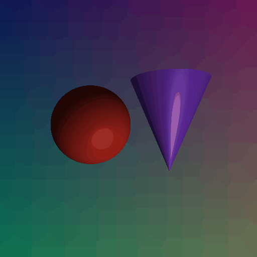

# 计算机图形学实验四：Phong 光照模型

## 一、项目架构

本实验单独放在 `Work4` 文件夹中，主要文件如下：

```text
Work4/
├── README.md
├── main.py
└── assets/
    └── demo.gif
```

`main.py` 中包含场景构建、球体与圆锥求交、深度竞争、Phong 着色器和 UI 参数调节逻辑。

## 二、代码逻辑

程序为屏幕上的每个像素发射一条光线，分别计算该光线与球体、圆锥的交点距离 `t`，并选择最小的正交点作为最终可见表面，实现类似 Z-buffer 的遮挡判断。

得到最近交点后，程序计算交点位置、法向量 `N`、光照方向 `L`、视线方向 `V` 和反射方向 `R`，再分别计算环境光、漫反射和镜面高光，最终累加得到该像素颜色。

## 三、实现功能

- 构建包含球体和圆锥的三维场景。
- 实现光线与球体、圆锥的相交检测。
- 实现最近深度选择，保证遮挡关系正确。
- 实现 Phong 光照模型。
- 支持调节 `Ka`、`Kd`、`Ks` 和 `Shininess`。

简单运行方式：

```powershell
uv run python Work4/main.py
```

## 四、效果展示



