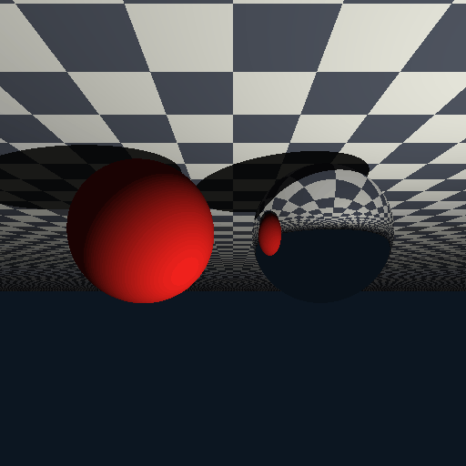

# 计算机图形学实验五：光线追踪

学号：202411081057  姓名：黄斐  专业：人工智能

## 一、项目架构

本实验单独放在 `Work5` 文件夹中，主要文件如下：

```text
Work5/
├── README.md
├── main.py
└── assets/
    └── demo.gif
```

`main.py` 中包含场景求交、镜面反射、硬阴影、迭代式光线弹射和 UI 参数调节。

## 二、代码逻辑

程序为每个像素发射一条主光线，使用 `scene_intersect()` 查找最近交点。场景中包含一个漫反射红球、一个镜面球和棋盘格地面。

光线追踪不使用递归，而是在每个像素内部通过循环进行多次弹射。若光线击中镜面球，程序根据反射公式更新光线方向，并让吞吐量乘以反射系数继续追踪；若击中漫反射物体，则向光源发射暗影射线判断硬阴影，并累加当前颜色后结束。

## 三、实现功能

- 构建包含球体和平面的三维场景。
- 实现最近交点检测。
- 实现基于循环的多次光线弹射。
- 实现镜面反射材质。
- 实现硬阴影，并使用法线偏移避免自相交。
- 支持调节光源位置和最大弹射次数。

简单运行方式：

```powershell
uv run python Work5/main.py
```

## 四、效果展示


