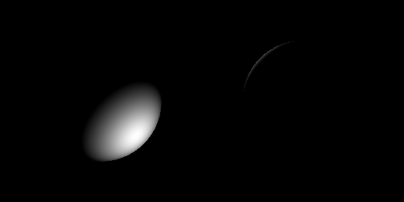

# 计算机图形学实验六：可微渲染

## 一、项目架构

本实验单独放在 `Work6` 文件夹中，采用实验六低难度版本的 Taichi 可微渲染方案：

```text
Work6/
├── README.md
├── main.py
└── assets/
    └── demo.gif
```

`main.py` 中包含目标图像生成、可微光照渲染、MSE loss 计算、自动求导和 Adam 参数更新。

## 二、代码逻辑

程序先定义一个位于 `(0.5, 0.5, 0.5)` 的球体，并使用目标光源 `(0.8, 0.8, 0.2)` 生成左侧目标图像。随后将待优化的 `light_pos` 声明为支持梯度的 Taichi field。

每次迭代时，程序用当前光源位置渲染右侧图像，并计算它与目标图像之间的 MSE loss。`ti.ad.Tape(loss)` 会自动反向传播得到 `light_pos.grad`，之后使用 Adam 优化器更新光源坐标，使右侧图像逐渐接近左侧目标图像。

## 三、实现功能

- 生成固定目标光照图像。
- 构建支持求导的 Taichi 渲染管线。
- 使用 Leaky Lambertian 光照保留可传播梯度。
- 使用 MSE loss 衡量目标图像与当前图像差异。
- 使用 Adam 优化光源三维坐标。
- 并排显示目标图像和当前优化结果。

简单运行方式：

```powershell
uv run python Work6/main.py
```

## 四、效果展示



