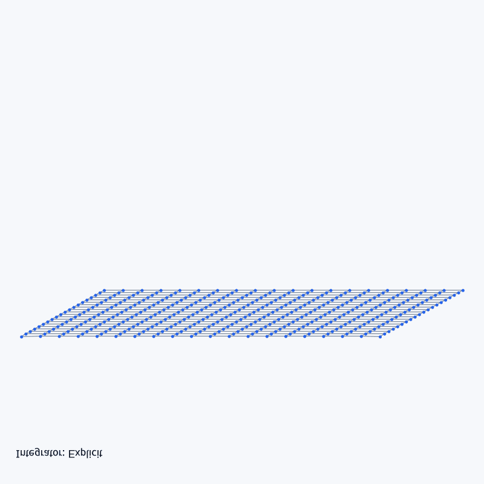

# 计算机图形学实验七：质点弹簧模型

## 一、项目架构

本实验单独放在 `Work7` 文件夹中，主要文件如下：

```text
Work7/
├── README.md
├── main.py
└── assets/
    └── demo.gif
```

`main.py` 中包含布料网格初始化、弹簧拓扑构建、力学计算、三种积分方法和渲染交互逻辑。

## 二、代码逻辑

程序将布料离散成 `20 x 20` 个质点，并为水平和竖直相邻质点建立结构弹簧。初始化时分多个 Taichi kernel 完成质点位置、速度、固定点和弹簧信息设置，保证 GPU 状态同步。

每一步模拟会计算重力、阻尼力和弹簧力。弹簧力通过 `ti.atomic_add` 累加到相邻质点上，避免并行写入冲突。随后可在显式欧拉、半隐式欧拉和定点迭代近似隐式欧拉三种积分方法之间切换，并使用速度钳制减少数值爆炸。

## 三、实现功能

- 初始化质点弹簧布料网格。
- 构建结构弹簧拓扑。
- 计算重力、阻尼和弹簧力。
- 实现显式欧拉积分。
- 实现半隐式欧拉积分。
- 实现定点迭代近似隐式欧拉积分。
- 支持暂停、重置和积分方法切换。

简单运行方式：

```powershell
uv run python Work7/main.py
```

## 四、效果展示



